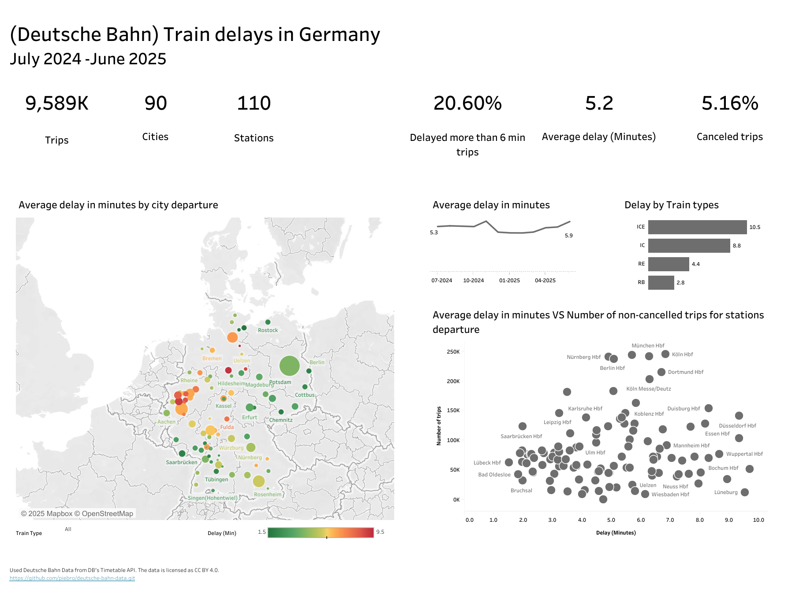

# (Deutsche Bahn) Train delay in Germany (July 2024–June 2025)

## Project Description

  

Analyse of 9589K railway trips in Germany (July 2024 to June 2025), including high-speed trains (ICE, IC) and regional trains(RB, RE).
Dashboard shows 110 largest railway stations of departure.

Data source is Parquet files, loaded with [Deutsche Bahn Data fetch tool](https://github.com/piebro/deutsche-bahn-data.git). The tool calls [Deutsche Bahn Timetable API](https://developers.deutschebahn.com/db-api-marketplace/apis/product/timetables). The data is licensed as the [CC BY 4.0](https://creativecommons.org/licenses/by/4.0/) by Deutsche Bahn.

The project workflow involves cleaning the data with Python, and making a dashboard in Tableau.

  
Workflow

## Workflow
### 0. **Download parquet files**
- Cloned repo from [Deutsche Bahn Data fetch tool](https://github.com/piebro/deutsche-bahn-data.git).
- Loaded and combined parquet files (2024-07 to 2025-06).

### 1. **Clean and import Data**
- Filteres trips with train types 'ICE', 'IC' as high speed trains and 'RE', 'RB' as regional trains.
- Replaced negative delays with 0
- Create 'city' column from 'station'
- Combine all PARQUET files to one CSV file.

### 2. **Check Data**
- Manually compare selected values by stations and months.

### 3. **Visualize Data in Tableau**
- The cleaned CSV file was imported into Tableau to create the dashboard.
    
  

  
The combined CSV file

  
| Station     | Delay in minutes | Time                 | Is canceled | Train type | City    |
|-------------|------------------|----------------------|-------------|------------|---------|
| Aachen Hbf  | 0                | 2024-07-01 00:41:00  | False       | RE         | Aachen  |
| Aachen Hbf  | 3                | 2024-07-01 00:04:00  | False       | RB         | Aachen  |
| …           | …                | …                    | …           | …          | …       |
| München Hbf | 1                | 2025-06-30 19:49:00  | False       | RB         | München |
| Trier Hbf   | 0                | 2025-06-30 23:59:00  | False       | RB         | Trier   |

  

## Results
### [🔗 **Dashboard (Tableau Public):**](https://public.tableau.com/app/profile/aleksandra.ermusheva/viz/20251030DeutscheBahnTraindelaysinGermany/Dashboard) 

  

- 20% of trains are delayed by more than 6 minutes.
- 5% of trains are canceled. 
- Delay times increase over the course of the year with the longest delays in summer months. 
- High-speed trains experience more delays than regional ones. 
- The longest average delays are for trains departing from Lüneburg, Hannover, Düsseldorf, Wolfsburg, and Wuppertal. The fewest delays occur on trains departing from Lübeck, Bad Oldesloe, Chemnitz, Frankfurt (Oder), and Potsdam.

  

## Useful Links
- [Project Repository](https://github.com/ermusheva/train_delay_germany)
- [Download the Dataset](https://github.com/piebro/deutsche-bahn-data.git)
- [Contact Me](mailto:ermusheva@gmail.com)
